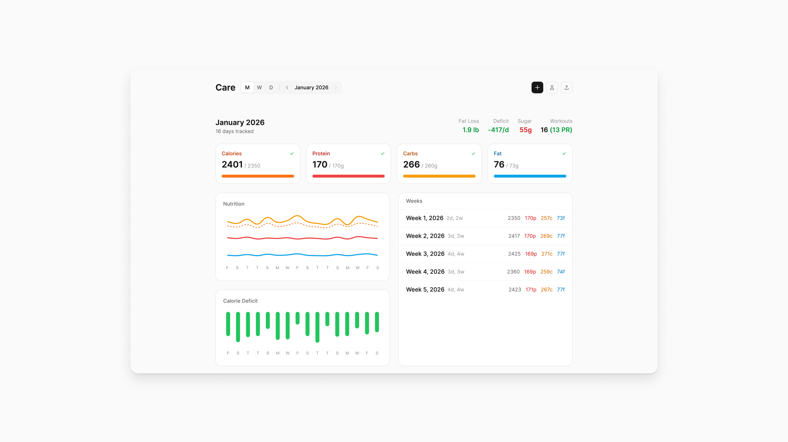

# Care

A simple way to look after your body, every day.



## Overview

Care is a single-file web application that helps track daily health metrics including:

- **Nutrition**: Calories, protein, carbs, fat, and sugar intake
- **Workouts**: Exercise type, duration, volume, and personal records
- **Weight**: Progress tracking toward goal weight
- **TDEE & Deficit**: Daily energy expenditure and caloric deficit calculations

## Getting Started

Open `index.html` in any modern browser. No server or build process required.

Data is stored in your browser's localStorage and persists between sessions.

## Data Collection Workflow

### Using Claude for Data Entry

The primary workflow involves conversing with Claude to log meals and workouts:

1. **Log meals naturally**: Tell Claude what you ate throughout the day
   - "I had eggs and toast for breakfast, a chicken salad for lunch..."
   - Claude calculates macros and formats the data

2. **Log workouts**: Describe your exercises
   - "I did 3 sets of 10 lat pulldowns at 110 lbs, then 25 minutes of cycling..."
   - Claude tracks volume, PRs, and calories burned

3. **Get structured JSON**: At the end of the day or week, ask Claude to output the data in the app's JSON format

4. **Import into Care**: Use the + button to paste the JSON data

### Managing Imports

Each import is tracked with a name and date range. Use the **Manage** tab in the import modal to view or delete previous imports.

### Sample Data

Import `sample-data-full.json` to explore the app with demo data covering several months of tracking.

### Manual Tracking

You can also manually track by:

1. Exporting current data (export button in header)
2. Editing the JSON file directly
3. Re-importing the updated data

### Data Structure

Each day entry includes:

```json
{
  "date": "2026-01-10",
  "dayOfWeek": "Friday",
  "nutrition": {
    "calories": 2490,
    "protein": 158,
    "carbs": 307,
    "fat": 71,
    "sugar": 130
  },
  "workout": {
    "type": "Day B",
    "duration": 60,
    "caloriesBurned": 456,
    "volume": 9530,
    "exercises": [
      {"name": "Lat pulldown", "weight": 110, "reps": 10, "sets": 3, "pr": true},
      {"name": "Cycling", "distance": 3.48, "duration": 25, "calories": 456}
    ]
  },
  "tdee": 2856,
  "deficit": -366,
  "notes": "Best protein day! Lat pulldown PR!"
}
```

## Features

- **Calendar view**: Navigate by day, week, or month
- **Progress charts**: Visualize trends over time
- **Workout analysis**: Track volume, PRs, and muscle group distribution
- **Weight tracking**: Monitor progress toward goal weight
- **Customizable targets**: Set personal macro and calorie goals
- **Import/Export**: Full data portability via JSON, with import tracking and management
- **Offline-first**: Works without internet, data stays local

## Tech Stack

- Vanilla JavaScript (no build step)
- Tailwind CSS (via CDN)
- Chart.js for visualizations
- Open Runde font
- localStorage for persistence
